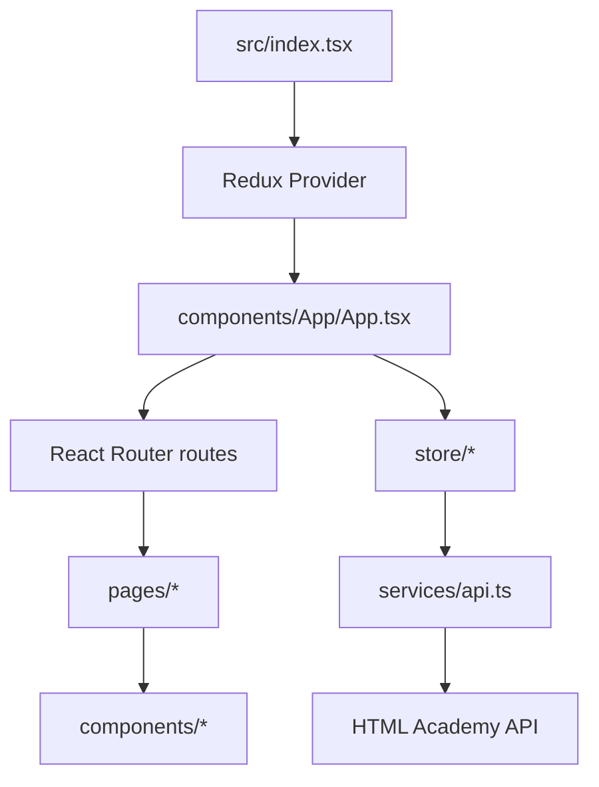

# Architecture

## Технологический стек

- React 18 + TypeScript
- Redux Toolkit (единый reducer)
- React Router v6
- Axios для API
- Leaflet для карт
- Vite для сборки

## Слои приложения

## Инициализация при старте

Источник: [`src/components/App/App.tsx`](../../src/components/App/App.tsx)

1. Приложение монтируется в `src/index.tsx`.
2. На старте `App` диспатчит:
   - `checkAuthAction()`
   - `fetchOffersAction()`
3. Пока статус авторизации `Unknown` или список офферов грузится, рендерится `Loading`.
4. После инициализации открывается роутинг приложения.

## Роутинг

Константы роутов: [`src/const.ts`](../../src/const.ts), enum `AppRoute`.

- `/` — главная страница (`MainScreen`)
- `/login` — авторизация (`LoginScreen`)
- `/favorites` — приватная страница (`FavoritesScreen` внутри `PrivateRoute`)
- `/offer/:id` — страница предложения (`OfferScreen`)
- `*` — `NotFoundScreen`

## Приватные роуты

`PrivateRoute` проверяет `authorizationStatus` из Redux store:
- `AUTH` → доступ разрешён
- иначе → редирект на `/login`

См. [`src/components/Private-route/Private-route.tsx`](../../src/components/Private-route/Private-route.tsx).

## Главные data-flow сценарии

### Главная страница

- `offers` загружаются из API и сохраняются в store.
- `MainScreen` фильтрует список по выбранному `cityName`.
- Сортировка в `MainScreen` локальная (UI-state, не Redux).

### Страница оффера

- По `:id` загружаются:
  - `GET /offers/:id`
  - `GET /offers/:id/nearby`
  - `GET /comments/:id`
- При `404` для оффера — флаг `isOfferNotFound` и рендер `NotFoundScreen`.
- Комментарий отправляется через `POST /comments/:id`, после успеха комментарии перечитываются.

### Авторизация

- `checkAuthAction` проверяет текущую сессию (`GET /login`).
- `loginAction` выполняет `POST /login`, сохраняет токен и пользователя.
- `logoutAction` сбрасывает токен и auth-состояние.

Подробности по API и auth: [`api-and-auth.md`](./api-and-auth.md).
