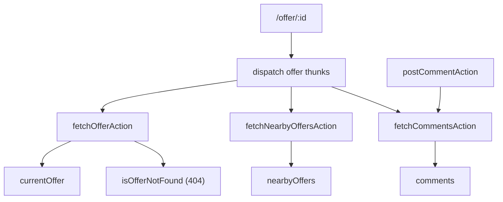

# State and Redux

## Store setup

- Store создаётся в [`src/store/index.ts`](../../src/store/index.ts).
- Используется `configureStore`.
- В thunk `extraArgument` передаётся Axios-инстанс `api`, созданный в `services/api.ts`.

## Структура состояния

Источник: [`src/store/reducer.ts`](../../src/store/reducer.ts)

- `cityName: string` — выбранный город на главной.
- `offers: Offer[]` — общий список офферов.
- `authorizationStatus: AuthorizationStatus` — состояние авторизации.
- `user: UserData | null` — текущий авторизованный пользователь.
- `isOffersLoading: boolean` — загрузка общего списка офферов.

Данные страницы оффера:
- `currentOffer: Offer | null`
- `nearbyOffers: Offer[]`
- `comments: Review[]`
- `isOfferNotFound: boolean`
- `isOfferDataLoading: boolean`
- `isCommentSending: boolean`

## Sync actions

Источник: [`src/store/action.ts`](../../src/store/action.ts)

### Главная
- `changeCity(cityName: string)`
- `loadOffers(offers: Offer[])`
- `setIsLoading(flag: boolean)`

### Авторизация
- `setAuthorizationStatus(status)`
- `setUser(user | null)`

### Страница оффера
- `setCurrentOffer(offer | null)`
- `setNearbyOffers(offers[])`
- `setComments(reviews[])`
- `clearOfferData()`
- `setOfferNotFound(flag)`
- `setOfferDataLoading(flag)`
- `setCommentSending(flag)`

## Async thunks

Источник: [`src/store/api-actions.ts`](../../src/store/api-actions.ts)

### Общие данные
- `fetchOffersAction` → `GET /offers`

### Offer page
- `fetchOfferAction(offerId)` → `GET /offers/:id`
- `fetchNearbyOffersAction(offerId)` → `GET /offers/:id/nearby`
- `fetchCommentsAction(offerId)` → `GET /comments/:id`
- `postCommentAction({ offerId, comment, rating })` → `POST /comments/:id`

### Авторизация
- `checkAuthAction` → `GET /login`
- `loginAction` → `POST /login`
- `logoutAction` → `DELETE /logout`

## Схема данных для Offer page

## Типы и их роль

Источник: [`src/types/types.ts`](../../src/types/types.ts)

- `Offer` — карточка/детальная модель оффера.
- `Comment` — API-форма комментария.
- `Review` — UI-форма комментария (отображение в списке).
- `NewCommentData` — payload для отправки нового комментария.
- `UserData`, `AuthData` — авторизация.

Преобразование `Comment -> Review` выполняется в `api-actions.ts` (`mapCommentToReview`).
